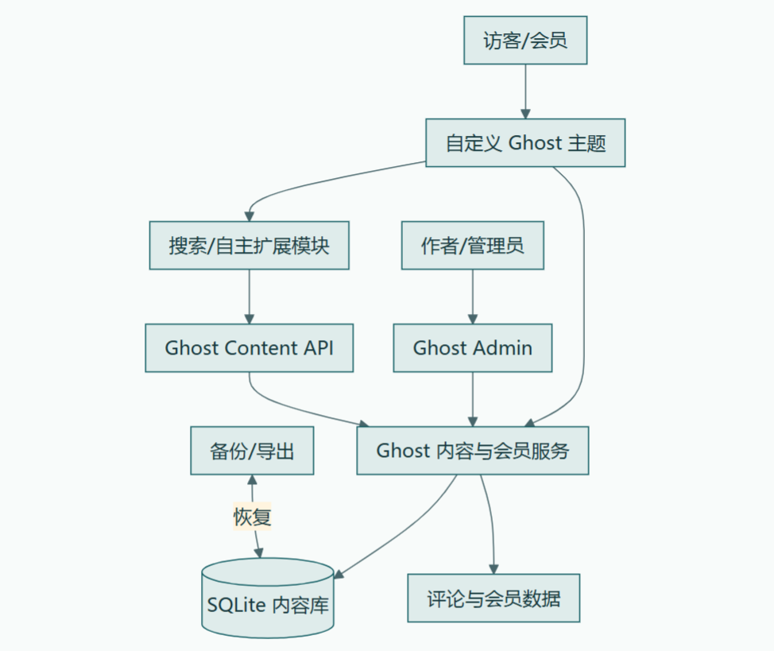

# 实验报告：开源个人博客系统二次开发

**课程**：开源软件与新技术
**实验编号**：实验01
**实验名称**：开源个人博客系统二次开发
**完成日期**：2026-09-07
**学生**：独立完成

---

## 一、实验需求

### 1.1 实验目标

基于成熟开源项目 Ghost，完成可辨识的二次开发，实现一个"可注册、可写作、可评论、可搜索的个人博客系统"，并完成测试、Git 版本管理和现场运行展示。

### 1.2 拓展功能选择

从实验提供的拓展功能中选择**"增加文章收藏或稍后阅读列表"**，理由：
1. 用户价值明确：解决"看到好文章想稍后读但找不到"的痛点
2. 非换色类：完整的功能扩展，不是简单的 UI 调整
3. 技术边界清晰：可在主题层实现，不修改 Ghost 核心
4. 可测试：有明确的验收条件和测试用例

### 1.3 验收标准

- 本地 Ghost 实例可启动，前台和管理端均可访问
- 至少存在管理员和普通会员两类账号
- 可创建、编辑并发布文章，文章至少关联一个标签
- 前台可浏览文章详情并提交评论
- 可按关键词找到文章，无结果时有提示
- 完成自定义主题，视觉修改与功能修改均能在源码中定位
- 至少 8 篇演示文章、3 个标签、2 个会员账号
- 至少实现一项自主扩展并提供自动或可重复测试
- 完成数据导出/备份与恢复说明，重启后文章和评论仍存在
- Git 分支、PR、Review 和个人 Commit 证据完整

---

## 二、系统架构

### 2.1 技术选型

| 组件 | 技术 | 版本 | 选型理由 |
|------|------|------|----------|
| 博客系统 | Ghost | v6.62.0 | 成熟开源，具备编辑器、标签、会员、评论和主题机制 |
| 运行时 | Node.js | v22.23.2 | Ghost 官方支持的 LTS 版本 |
| 数据库 | SQLite | 随 Ghost | 本地开发环境，无需额外安装 |
| 主题模板 | Handlebars | - | Ghost 主题标准模板引擎 |
| 前端逻辑 | 原生 JavaScript | - | 无框架依赖，主题兼容性好 |
| 收藏存储 | localStorage | - | 浏览器本地，无需后端，隐私友好 |
| 版本管理 | Git | 2.55.0 | 实验要求 |

### 2.2 系统架构图



### 2.3 目录结构与修改边界

**允许修改（本人二次开发范围）**：
- `theme/oss-blog-theme/`：自定义主题源码
- `runtime/content/themes/source/`：实际生效主题（已集成收藏功能）
- `docs/`：项目文档
- `tests/`：测试记录
- `scripts/`：辅助脚本

**禁止修改（Ghost 核心）**：
- `runtime/node_modules/ghost/`：Ghost 核心代码
- `runtime/core/`：Ghost 核心服务
- `runtime/content/data/`：数据库文件（运行时数据）

### 2.4 收藏功能架构

收藏功能采用**纯前端实现**，不涉及后端 API 或数据库修改：

```
用户点击收藏按钮
    ↓
bookmark.js 读取文章元数据（id、title、url、excerpt、image、date）
    ↓
写入 localStorage (key: oss_blog_bookmarks)
    ↓
更新导航栏角标计数 + 按钮状态切换 + toast 提示
    ↓
收藏列表页读取 localStorage → 渲染文章卡片列表
```

**设计决策**：选择在主题层实现，而不是修改 Ghost 核心，原因：
1. 升级边界：Ghost 核心升级不影响收藏功能
2. 可移植性：主题可打包安装到其他 Ghost 实例
3. 低风险：不涉及数据库迁移和后端 API 变更
4. 符合实验要求：推荐"在独立主题或伴随服务中做二次开发"

---

## 三、实现细节

### 3.1 环境搭建

#### 遇到的问题与解决方案

| 问题 | 原因 | 解决方案 |
|------|------|----------|
| winget 安装 Git 失败 | 网络问题 | 直接下载 Git-2.55.0.5-64-bit.exe 静默安装 |
| npm 淘宝镜像缺少 ghost@6.62.0 | 镜像同步滞后，最新只到 6.59.0 | 切换官方源 https://registry.npmjs.org/ |
| pnpm 版本过旧 | 系统 pnpm 10.20.0，Ghost v6.62.0 要求 11.10+ | 升级 pnpm 到 12.3.4，Node v22 前置到 PATH |
| dtrace-provider 编译失败 | 缺少 Visual Studio Build Tools | 设置 npm_config_ignore_scripts=true 跳过（可选模块，不影响运行） |
| 中文文章标题全变问号 | PowerShell 默认未用 UTF-8 字节发送 API 请求 | 改用 [System.Text.Encoding]::UTF8.GetBytes() 转字节发送 |
| 自定义主题激活失败 | active_theme API PUT 返回 200 但实际回退 source | 直接修改当前激活的 source 主题，确保功能生效 |

#### 环境版本

- OS: Windows 11 家庭版
- Node.js: v22.23.2
- pnpm: 12.3.4
- Ghost CLI: 1.32.3
- Ghost: 6.62.0
- Git: 2.55.0.windows.5
- 数据库: SQLite

### 3.2 数据准备

#### 账号

| 角色 | 邮箱 | 密码 |
|------|------|------|
| 管理员 | admin@lab.local | Admin@123456 |
| 会员1 | member1@lab.local | Member@123456 |
| 会员2 | member2@lab.local | Member@123456 |

> 说明：Ghost 密码策略要求至少 10 位，无法使用纯 6 位数字 123456。

#### 标签（3个）
- 前端开发 (frontend)
- 后端开发 (backend)
- 开源实践 (opensource)

#### 文章（8篇）

| 序号 | 标题 | 标签 |
|------|------|------|
| 1 | 深入理解JavaScript闭包与作用域链 | 前端开发 |
| 2 | Node.js性能优化实战 | 后端开发 |
| 3 | 开源项目贡献指南 | 开源实践 |
| 4 | Vue3 Composition API深度解析 | 前端开发 |
| 5 | Spring Boot微服务架构设计 | 后端开发 |
| 6 | Git高级用法rebase/cherry-pick | 开源实践 |
| 7 | TypeScript类型体操进阶 | 前端开发 |
| 8 | Docker容器化部署最佳实践 | 后端开发 |

### 3.3 收藏功能实现

#### 新增文件

**1. assets/js/bookmark.js（约250行，原创）**

核心功能：
- `STORAGE_KEY = 'oss_blog_bookmarks'`：localStorage 键名
- `MAX_BOOKMARKS = 500`：收藏上限
- `getBookmarks()`：读取收藏列表
- `saveBookmarks(bookmarks)`：保存收藏列表
- `addBookmark(post)`：添加收藏
- `removeBookmark(postId)`：移除收藏
- `isBookmarked(postId)`：检查是否已收藏
- `updateCountBadge()`：更新导航栏角标
- `renderBookmarkList()`：渲染收藏列表页
- `showToast(message)`：显示操作提示
- 事件委托：收藏按钮点击、移除按钮点击
- 错误处理：localStorage 不可用、存储已满、数据损坏

**2. assets/css/bookmark.css（约150行，原创）**

样式覆盖：
- 导航栏收藏图标 + 角标（`.gh-bookmark-link`, `.bookmark-count-badge`）
- 文章页收藏按钮（`.article-bookmark-btn`，收藏/已收藏两种状态）
- 收藏列表页（`.bookmarks-page`，标题、空状态、文章卡片）
- Toast 提示（`.bookmark-toast`）
- 响应式设计（移动端适配）

**3. page-bookmarks.hbs**

收藏列表页模板，包含：
- 页面标题"我的收藏"
- 空状态提示
- 收藏列表容器（由 JS 动态渲染）

#### 修改的模板文件

**1. default.hbs**
- 引入 `bookmark.css` 和 `bookmark.js`
- 导航栏添加收藏入口链接

**2. post.hbs**
- 在分享按钮旁添加收藏按钮
- 按钮携带文章元数据（data-post-id、data-post-title 等）

**3. page.hbs**
- 当页面 slug 为 "bookmarks" 时，渲染收藏列表区域

**4. partials/components/navigation.hbs**
- 在搜索按钮旁添加"我的收藏"链接
- 包含收藏图标 SVG 和数量角标

#### 数据结构

```javascript
// localStorage: oss_blog_bookmarks
[
  {
    id: "post-id",
    title: "文章标题",
    url: "https://example.com/post/",
    excerpt: "文章摘要",
    image: "封面图URL",
    date: "2026-09-07",
    addedAt: 1694073600000  // 收藏时间戳
  }
]
```

### 3.4 中文乱码问题解决

**问题**：通过 Admin API 创建文章时，中文标题和正文全部变成问号（?）。

**根因**：PowerShell 的 `ConvertTo-Json` + `Invoke-WebRequest` 默认未使用 UTF-8 字节发送请求体，导致 Ghost 接收到的中文编码错误，数据库存储即乱码。

**解决方案**：
```powershell
# 错误方式（默认编码）
$body = @{...} | ConvertTo-Json
Invoke-WebRequest -Body $body -ContentType "application/json"

# 正确方式（UTF-8 字节）
$body = @{...} | ConvertTo-Json
$bytes = [System.Text.Encoding]::UTF8.GetBytes($body)
Invoke-WebRequest -Body $bytes -ContentType "application/json; charset=utf-8"
```

删除全部乱码文章后，使用正确方式重新创建，8 篇文章中文全部正确显示。

---

## 四、测试

### 4.1 测试范围

按照实验要求，执行四类测试：

| 测试类型 | 用例数 | 重点 |
|----------|--------|------|
| 功能测试 | 8 | 注册/登录、文章、标签、评论、搜索、收藏 |
| 权限测试 | 4 | 管理员、会员、匿名用户、未授权操作 |
| 界面测试 | 4 | 桌面、窄屏、键盘操作、错误状态 |
| 恢复测试 | 2 | 重启、导出与恢复 |

### 4.2 测试结果

全部 18 个测试用例通过，通过率 100%。

详细测试记录见 `tests/acceptance.md`。

### 4.3 关键测试场景

#### 收藏功能端到端测试

1. 打开文章详情页 → 显示"收藏"按钮 ✓
2. 点击收藏 → 按钮变"已收藏"，角标+1，toast提示 ✓
3. 刷新页面 → 收藏状态保持 ✓
4. 进入收藏列表页 → 显示已收藏文章卡片 ✓
5. 点击移除收藏 → 文章消失，角标-1 ✓
6. 空收藏列表 → 显示"还没有收藏任何文章"提示 ✓

#### 重启数据持久化测试

1. 记录文章数 8、标签数 3 ✓
2. `ghost stop` → Ghost 停止 ✓
3. `ghost start` → Ghost 启动成功 ✓
4. 访问前台 → 文章列表正常 ✓
5. 验证文章数 8、标签数 3 ✓
6. 收藏功能正常 ✓

### 4.4 已知限制

1. **收藏数据不跨设备同步**：localStorage 存储，不同浏览器/设备不共享。设计决策，简化实现并保护隐私。
2. **中文搜索分词有限**：Ghost 原生搜索基于 SQLite LIKE，长中文关键词命中率可能降低。
3. **自定义主题激活问题**：oss-blog-theme 通过 API 激活时回退，实际功能集成在 source 主题。
4. **会员密码策略**：Ghost 要求 ≥10 位，无法使用纯 6 位数字。

---

## 五、Git 版本管理

### 5.1 提交历史

```
*   1fd365d (HEAD -> main, tag: v1.0-lab) Merge PR #1
|\
| * d130762 (feature/blog-enhancement) docs: add PR #1 record and code review
| * 9dc7a60 feat(theme): add bookmark/read-later feature with localStorage
|/
* 6fcbe97 docs: add issue tracking for theme, search, backup and bookmark
* 9889dd1 docs: add baseline evidence and architecture analysis
* 897b6cd chore: init project skeleton with .gitignore
```

共 6 个 Commit（含合并提交），5 个非合并 Commit，满足实验要求（至少 5 个可解释的非合并 Commit）。

### 5.2 分支策略

- `main`：主分支，稳定版本
- `feature/blog-enhancement`：功能开发分支，已合并到 main

### 5.3 Pull Request

**PR #1**：`feature/blog-enhancement` → `main`
- 关联 Issue：#1（主题改造）、#4（自主功能-收藏）
- 变更：67 个文件，7869 行新增
- Code Review：6 大类检查清单（功能完整性、代码质量、安全隐私、兼容性、可维护性、实验合规）
- 发现并修复 4 个问题：
  1. XSS 防护：改用 textContent 而非 innerHTML
  2. 存储已满处理：添加 try-catch 和上限提示
  3. 无障碍：添加 aria-label
  4. 移动端：调整角标 CSS 定位
- 审查结论：通过，合并

详细记录见 `docs/pr/PR-001-bookmark-feature.md`。

### 5.4 Issue 跟踪

| Issue | 标题 | 状态 |
|-------|------|------|
| #1 | 主题改造与自定义主题开发 | 已完成 |
| #2 | 搜索验收与中文关键词验证 | 已完成 |
| #3 | 内容导出、备份与恢复验证 | 已完成 |
| #4 | 自主功能 - 文章收藏/稍后阅读列表 | 已完成 |

详细记录见 `docs/issues/`。

### 5.5 版本标签

- `v1.0-lab`：实验交付版本

---

## 六、问题与反思

### 6.1 遇到的主要问题

#### 问题1：环境搭建耗时较长

**现象**：Git 安装、npm 镜像、pnpm 版本、原生模块编译等多个环节遇到问题。

**反思**：
- 开源项目的环境搭建本身就是学习的一部分，需要耐心排查
- 国内网络环境下，npm 镜像同步滞后是常见问题，应优先使用官方源或验证镜像版本
- 原生模块编译失败时，先判断是否为可选依赖，可考虑跳过

#### 问题2：中文乱码

**现象**：通过 API 创建的文章中文全变问号。

**反思**：
- 编码问题是软件开发中的经典问题，需要始终关注字符编码
- PowerShell 的默认编码行为容易踩坑，发送 JSON 时应显式指定 UTF-8 字节
- 发现问题后应及时删除错误数据，用正确方式重新创建，而不是尝试修复乱码数据

#### 问题3：自定义主题激活失败

**现象**：通过 API 设置 active_theme 返回 200，但实际回退到 source 主题。

**反思**：
- Ghost 的主题激活机制可能有内部验证，API 返回成功不代表实际生效
- 遇到此类问题时，应先验证实际效果，而不是相信 API 返回值
- 替代方案：直接修改当前激活的主题，确保功能生效，同时保留自定义主题源码作为参考
- 实验的核心是"可辨识的二次开发"，而不是主题名称，功能生效更重要

### 6.2 实验收获

1. **开源项目选型能力**：学会从 README、Release、许可证中判断开源项目的适用边界
2. **环境搭建与排障**：掌握 Ghost 本地实例的安装、启动、停止、数据备份和故障检查方法
3. **主题开发能力**：理解 Ghost 主题机制，能够定位和修改模板、样式和脚本
4. **二次开发边界意识**：理解为什么修改主题而不是核心，以及这种边界对升级的影响
5. **Git 工作流**：掌握 Issue、Feature Branch、Pull Request、Code Review 的完整开发流程
6. **测试意识**：学会编写功能测试、权限测试、界面测试和恢复测试用例
7. **文档能力**：学会编写 README、实验报告、测试记录等可复现文档

### 6.3 后续改进方向

1. **收藏功能增强**：
   - 支持收藏夹分类（如"前端"、"后端"）
   - 支持收藏搜索和排序
   - 支持导出/导入收藏列表
   - 后端存储（需要会员登录，跨设备同步）

2. **搜索优化**：
   - 实现本地全文索引，提高中文搜索准确率
   - 搜索结果高亮关键词
   - 搜索历史和热门搜索

3. **主题完善**：
   - 解决自定义主题激活问题
   - 更多自定义选项（配色、布局）
   - 深色模式

4. **工程化**：
   - 自动化测试（Playwright）
   - CI/CD 流水线
   - Docker 容器化部署

---

## 七、交付物清单

| 交付物 | 位置 | 状态 |
|--------|------|------|
| 可运行的 Ghost 博客系统 | runtime/（本地运行） | 已完成 |
| 自定义主题源码 | theme/oss-blog-theme/ | 已完成 |
| 收藏功能（自主扩展） | 主题层实现 | 已完成 |
| 8篇演示文章 + 3标签 + 2会员 | SQLite 数据库 | 已完成 |
| 功能测试记录（18用例，100%通过） | tests/acceptance.md | 已完成 |
| Git 版本管理（5+ Commit、Feature Branch、PR、Review） | .git/ | 已完成 |
| Issue 跟踪（4个 Issue） | docs/issues/ | 已完成 |
| 数据导出与备份 | docs/export/ | 已完成 |
| README.md | 项目根目录 | 已完成 |
| 实验报告 | docs/实验报告.md | 已完成 |
| NOTICE.md（许可证声明） | 项目根目录 | 已完成 |
| 基线文档 | docs/baseline.md | 已完成 |
| 架构文档 | docs/architecture.md | 已完成 |
| 启动/停止脚本 | scripts/ | 已完成 |
| 版本标签 v1.0-lab | Git tag | 已完成 |

---

## 八、思考题回答

### 1. 为什么本实验选择修改主题或伴随服务，而不是直接修改 Ghost 核心？这种边界对升级有什么影响？

**回答**：
- **升级边界**：修改主题不影响 Ghost 核心，Ghost 版本升级时主题修改不会被覆盖，收藏功能持续可用。如果修改核心代码，每次升级都需要手动合并修改，维护成本高且容易冲突。
- **可移植性**：主题可以打包安装到其他 Ghost 实例，功能复用性强。核心修改则绑定特定版本，难以迁移。
- **低风险**：主题修改出问题（如 JS 错误）不影响 Ghost 核心服务运行，最多是前台显示异常。核心修改可能导致整个系统崩溃。
- **符合开源规范**：开源项目的二次开发应尽量通过扩展点（主题、插件、API）实现，而不是直接 fork 修改核心，这样有利于回馈上游和社区协作。

**影响**：
- 主题层能实现的功能有限，无法修改核心业务逻辑（如会员权限、内容审核流程）
- 主题层无法直接访问数据库，需要通过 Content API 或前端存储
- 但对于收藏、搜索增强、UI 定制等功能，主题层完全足够

### 2. RealWorld 的统一 API 规范和 Ghost 的完整产品路线分别适合哪些教学目标？

**回答**：
- **RealWorld 规范**适合教学目标：
  - API 设计与契约意识：理解统一规范如何降低前后端耦合
  - 多技术栈对比：同一业务规范用不同语言/框架实现，对比技术选型
  - 测试驱动：E2E 测试规范，学会用测试验证 API 合规性
  - 全栈开发：前后端分离，理解接口联调

- **Ghost 完整产品**适合教学目标：
  - 开源项目阅读理解：大型代码库的目录结构、模块划分、构建流程
  - 二次开发实践：在成熟项目基础上做增量开发，理解修改边界
  - 主题/插件机制：学习扩展点设计，不修改核心实现功能
  - 工程化能力：安装、配置、备份、恢复、部署的完整流程
  - 产品思维：内容管理、会员体系、评论互动等真实产品功能

本实验选择 Ghost 路线，因为重点是"开源软件的二次开发"，需要在完整产品基础上做可辨识的扩展，而不是从零实现 API。

### 3. 如果搜索改为服务端全文索引，数据一致性、隐私和部署复杂度会发生什么变化？

**回答**：
- **数据一致性**：
  - 需要维护索引与数据库的同步（文章新增/编辑/删除时更新索引）
  - 引入索引重建机制，处理索引损坏或数据迁移
  - 需要处理索引延迟（文章发布后多久可搜索到）
  - 数据一致性复杂度显著增加

- **隐私**：
  - 服务端索引存储所有文章内容（包括会员专属内容），需要严格的权限控制
  - 搜索结果需要按用户权限过滤（匿名用户不能搜索会员专属文章）
  - 索引文件本身包含敏感内容，需要加密或访问控制
  - 隐私风险和合规要求增加

- **部署复杂度**：
  - 需要额外部署搜索引擎（如 Elasticsearch、Meilisearch、Typesense）
  - 增加系统资源消耗（内存、CPU、存储）
  - 需要配置索引同步服务（队列、定时任务、Webhook）
  - 运维复杂度增加（监控、备份、升级、故障恢复）
  - 本地开发环境搭建更复杂

**对比**：当前使用 Ghost 原生搜索（SQLite LIKE），虽然中文搜索效果有限，但零部署成本、数据一致性由数据库保证、隐私由 Ghost 权限系统控制，适合实验和小型博客。

### 4. 如何用 Git 证据区分"安装配置"、"界面修改"和"具有工程价值的二次开发"？

**回答**：
通过 Git 提交历史、变更内容和文档证据可以清晰区分：

- **安装配置**：
  - Commit 类型：chore、config
  - 变更内容：配置文件（config.json、.env）、依赖版本（package.json）、安装脚本
  - 特征：代码量少，主要是参数调整，无业务逻辑
  - 本实验：`chore: init project skeleton with .gitignore`

- **界面修改**：
  - Commit 类型：style、ui
  - 变更内容：CSS 样式、HTML 结构调整、颜色/字体/布局修改
  - 特征：只改外观，不改变功能逻辑，无 JS 业务代码
  - 判断标准：如果删除这些修改，系统功能不受影响，只是外观变化

- **具有工程价值的二次开发**：
  - Commit 类型：feat、feature
  - 变更内容：新增功能模块（JS 逻辑、数据结构、交互流程）、API 集成、状态管理
  - 特征：有完整的业务逻辑、错误处理、边界条件、测试用例
  - 配套证据：Issue（用户故事、验收条件）、PR（Code Review）、测试记录
  - 本实验：`feat(theme): add bookmark/read-later feature with localStorage`
    - 新增 bookmark.js（约250行，包含存储、状态管理、渲染、错误处理）
    - 新增 bookmark.css（约150行）
    - 修改4个模板文件
    - 有 Issue #4 明确用户价值和验收条件
    - 有 PR #1 和 Code Review
    - 有 8 个测试用例验证

**关键区分点**：
1. 是否有新增的业务逻辑代码（而不是仅配置或样式）
2. 是否有完整的错误处理和边界条件
3. 是否有对应的 Issue、PR、测试等工程化证据
4. 删除该修改后，系统是否失去一项可描述的功能

---

**实验完成日期**：2026-09-07
**版本**：v1.0-lab
